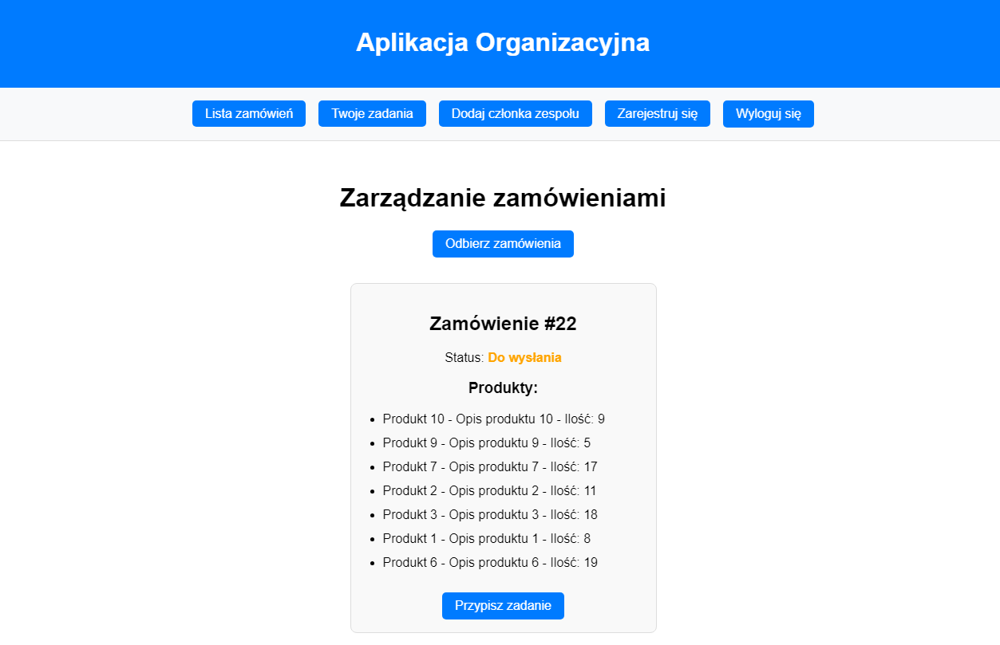

# Task Management App

Aplikacja do zarządzania zadaniami w zespołach, zaprojektowana z myślą o efektywnym przypisywaniu i monitorowaniu realizacji zadań w ramach organizacji. Aplikacja pozwala administratorom generować zadania, przypisywać je członkom zespołu oraz monitorować postępy w realizacji.

---

## **Technologie**

- **Backend:**
  - [Laravel 11](https://laravel.com/) – framework PHP do budowy API i obsługi logiki backendu.
  - [Laravel Sanctum](https://laravel.com/docs/11.x/sanctum) – uwierzytelnianie z użyciem tokenów.
  - [Docker](https://www.docker.com/) – środowisko dla bazy danych.

- **Frontend:**
  - [Vue 3](https://vuejs.org/) – framework do budowy dynamicznych interfejsów użytkownika.
  - [Nuxt 3](https://nuxt.com/) – framework oparty na Vue do budowy aplikacji uniwersalnych.
  - [Pinia](https://pinia.vuejs.org/) – system zarządzania stanem aplikacji.
  - [Axios](https://axios-http.com/) – biblioteka do obsługi żądań HTTP.

- **Baza danych:**
  - [PostgreSQL](https://www.postgresql.org/) – relacyjna baza danych uruchomiona w kontenerze Docker.

---

## **Funkcjonalności**

1. **Autoryzacja i role użytkowników:**
   - Rejestracja i logowanie z użyciem tokenów autoryzacyjnych.
   - Obsługa ról użytkowników: `admin` (administrator) i `member` (członek zespołu).

2. **Zarządzanie zadaniami:**
   - Generowanie zadań dla organizacji na żądanie administratora.
   - Przypisywanie zadań członkom zespołu.
   - Monitorowanie postępów w realizacji zadań.

3. **Zarządzanie zespołem:**
   - Administrator może przeglądać listę członków zespołu w organizacji.
   - Lista zawiera użytkowników z przypisaną rolą `member`.

4. **Dynamiczny interfejs użytkownika:**
   - Wyświetlanie list zadań i członków zespołu.
   - Obsługa błędów i powiadomień w czasie rzeczywistym.

5. **Bezpieczeństwo:**
   - Uwierzytelnianie oparte na tokenach.
   - Dostęp do zasobów ograniczony na podstawie roli użytkownika.
